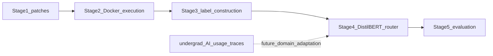

# Architecture

This document describes the Stage 1 module structure and data flow of **Hecate**, and the planned downstream stages. DistilBERT-class routing is **not shipped**; this repository currently implements Stage 1 (patch generation) only.

For the SIP off-boarding companion, see [HANDOFF.md](HANDOFF.md). Structural metrics and course telemetry live in the sibling repo [`scottyUX/ts-repo-metrics`](https://github.com/scottyUX/ts-repo-metrics).

## Stage 1 data flow (implemented)

Every model receives the same issue text, file context, and prompt. The only variable is the OpenRouter model slug. Successful generations may be stored in a content-hash keyed cache so re-runs do not re-spend.


**Objective:** For each of 300 SWE-bench Lite tasks, collect one attempted patch from each of four models (1,200 samples) plus metadata downstream stages can read.

## Planned stages (not implemented)

Stages 2–5 and SDLC domain adaptation are backlog epics (`E-M3`–`E-M6` / issues #17–#20). They are shown here so incoming researchers see how Stage 1 outputs feed the router.



| Stage | Role | Status |
|-------|------|--------|
| 1 — Patch generation | Shared scaffold → OpenRouter → normalized patch + metadata | **In progress** (S3–S9 done; S10–S16 remain) |
| 2 — Execution | Apply patches; run tests in Docker | Epic #17 |
| 3 — Label construction | Cheapest resolving tier (or binary escalate) | Epic #17 |
| 4 — Router training | DistilBERT-class encoder on execution-grounded labels | Epic #18 |
| 5 — Evaluation | Router vs always-small / always-large / oracle | Epic #19 |
| SDLC adaptation | Fine-tune / adapt using course AI-usage data | Epic #20 |

## Module map

```
src/hecate/
├── data/          # SWE-bench Lite loading, canonical generation records
├── scaffold/      # Oracle/BM25 context builder, Stage-1 prompt template
├── generation/    # OpenRouter client, patch extraction
├── caching/       # Content-hash keyed success-only cache
├── cost/          # Token accounting + budget guard (S10 — not done)
└── utils/         # Env, logging, manifests, hashing
```

| Package | Responsibility |
|---------|----------------|
| `hecate.data` | Task loaders and record schema for the full (task, model) matrix |
| `hecate.scaffold` | Identical context + prompt for every model (`context.py`, `prompt.py`) |
| `hecate.generation` | Async OpenRouter client, errors, unified-diff patch extraction |
| `hecate.caching` | Lookup/store by content hash; success-only entries |
| `hecate.cost` | Budget target/ceiling enforcement (planned S10) |
| `hecate.utils` | `OPENROUTER_API_KEY` loading, hashing helpers |

Config lives in [`configs/option_a.yaml`](../configs/option_a.yaml) (model slugs, tiers, prices, decoding, budget). Entry scripts: [`scripts/run_pilot.py`](../scripts/run_pilot.py), [`scripts/run_sweep.py`](../scripts/run_sweep.py) (blocked on S10–S11).

## Invariants (Stage 1)

1. **Shared scaffold** — only the model slug differs across counterfactuals.
2. **Single-shot generation (v1)** — one prompt → one patch; no multi-turn agent loop.
3. **Oracle or BM25 context** — same retrieval method for all models in a run.
4. **Full counterfactual matrix** — persist every (task, model) outcome.
5. **Rich storage, deferred labels** — Stage 3 chooses binary vs multiclass later.
6. **Reproducibility** — each run writes a manifest (config snapshot, slugs, timestamp, git commit, cost).

## Sibling systems

Hecate does not host the course dashboard or static analyzer. Quality scoring for a future feature-scale benchmark and undergrad AI-usage telemetry are developed in [`ts-repo-metrics`](https://github.com/scottyUX/ts-repo-metrics) and [`agent_stats`](https://github.com/scottyUX/agent_stats). See the ecosystem diagram in that repo’s [ARCHITECTURE.md](https://github.com/scottyUX/ts-repo-metrics/blob/main/docs/ARCHITECTURE.md).
