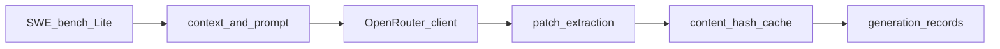

# Hecate Project Handoff

**From:** Outgoing SIP interns (6-week program)  
**To:** Jaisree David RaviKumar, Jacob Johnston  
**Facilitator:** Scott  

Reference companion for the handoff meeting. Architecture detail: [ARCHITECTURE.md](ARCHITECTURE.md). Course telemetry and the structural analyzer live in [`scottyUX/ts-repo-metrics`](https://github.com/scottyUX/ts-repo-metrics) — see that repo’s [`docs/HANDOFF.md`](https://github.com/scottyUX/ts-repo-metrics/blob/main/docs/HANDOFF.md).

---

## 1. Project Overview

Hecate is a lightweight routing framework for LLM-assisted software engineering. The long-term goal is a DistilBERT-class router that predicts whether a coding task can stay on a *small* model or must escalate to a *large* model, using **execution-grounded** labels (the cheapest tier that actually fixes the task).

**This repository currently covers Stage 1 only** — patch generation for SWE-bench Lite. It does not run tests, build routing labels, or train a router. DistilBERT training and evaluation are future epics (#18–#19).

### Stage 1 objective

For each of **300** SWE-bench Lite tasks, collect one attempted fix from each of **four** models under an identical generation setup → **1,200** patches plus metadata.

### Option A models

Configured in [`configs/option_a.yaml`](../configs/option_a.yaml) (slugs verified 2026-07-14 against OpenRouter). Budget: target **$38**, ceiling **$100**.

| Tier | Model | OpenRouter slug |
|------|-------|-----------------|
| large | Qwen 2.5 72B | `qwen/qwen-2.5-72b-instruct` |
| large | Llama 3.3 70B | `meta-llama/llama-3.3-70b-instruct` |
| small | Qwen 2.5 7B | `qwen/qwen-2.5-7b-instruct` |
| small | Llama 3.1 8B | `meta-llama/llama-3.1-8b-instruct` |

### Relationship to ts-repo-metrics

Structural / lexical quality scoring and undergraduate AI-usage telemetry are developed in `ts-repo-metrics` (and `agent_stats`). Hecate Stage 1 does not call that analyzer. A future feature-scale benchmark and SDLC domain adaptation (epic #20) are expected to consume those signals.

---

## 2. System Architecture Notes

Full module map: [ARCHITECTURE.md](ARCHITECTURE.md). Board issue index: [BOARD_SETUP.md](BOARD_SETUP.md).

| ID | Component | Status |
|----|-----------|--------|
| S3 | Data loading & canonical schema | Done |
| S4 | Model slugs & pricing (`option_a.yaml`) | Done |
| S5 | Oracle/BM25 context builder | Done |
| S6 | Stage-1 prompt template | Done |
| S7 | OpenRouter client wrapper | Done |
| S8 | Patch extraction & normalization | Done |
| S9 | Caching layer | Done |
| S10 | Cost tracker & budget guard | Not done |
| S11 | Generation runner | Not done |
| S12–S13 | Pilot (20 tasks) + go/no-go | Blocked on S10–S11 |
| S14–S16 | Full sweep, validation, Stage-1 artifact | Blocked on pilot |
| E-M3 #17 | Execution & labels (Docker) | Epic — not started |
| E-M4 #18 | Router training (DistilBERT-class) | Epic — not started |
| E-M5 #19 | Evaluation vs baselines | Epic — not started |
| E-M6 #20 | SDLC adaptation from course AI logs | Epic — not started |

**Known mid-flight items:** cost package and pilot/sweep scripts are not yet runnable end-to-end; Stage 3 label scheme (binary escalate vs multiclass cheapest-resolver) is deferred until after the pilot.

---

## 3. Codebase & Environment

| Item | Value |
|------|-------|
| Remote | https://github.com/scottyUX/hecate |
| Default branch | `main` (feature work often merges via Spec Kit branches / PRs) |
| Language | Python (`pyproject.toml`, `pip install -e ".[dev]"`) |
| Config | `configs/option_a.yaml` |
| Secrets | `.env` with `OPENROUTER_API_KEY` (see `.env.example`) — never commit |
| Lab webpage | `web/` → GitHub Pages (`.github/workflows/deploy-web.yml`) |
| Board | [Hecate — Stage 1](https://github.com/users/scottyUX/projects) — setup in [BOARD_SETUP.md](BOARD_SETUP.md) |

**Branch / PR conventions:** Spec Kit feature branches (`006-prompt-template`, `007-openrouter-client`, `008-patch-extraction`, `009-caching-layer`, …); issue-driven stories S1–S16 and epics E-M3–E-M6.

### Cloud & SaaS map

| Service | Role |
|---------|------|
| GitHub | Source, issues, project board, Pages for `web/` |
| OpenRouter | Stage 1 chat completions |
| GCP | Planned Stage 2/4 compute only — see [GCP_COST_ESTIMATE.md](GCP_COST_ESTIMATE.md); not required for Stage 1 |

Supabase, Vercel, and Railway host the **ts-repo-metrics** dashboard, not Hecate Stage 1.

---

## 4. Datasets

### Stage 1 generation outputs (this repo)

- **What:** Per-(task, model) patch attempts, raw model text, usage metadata, cache keys — schema under `src/hecate/data/`.
- **Where:** `data/` is gitignored (`raw/`, `cache/`, `outputs/`). Downstream stages will consume the Stage-1 handoff artifact (S16).
- **Source tasks:** SWE-bench Lite (300 instances).
- **Cadence:** Batch pilot then full sweep once S10–S11 land — not continuous collection.

### Consumed later (not stored here)

Undergraduate AI-usage traces and repo structural reports live in Supabase / exports under `ts-repo-metrics`. Epic #20 (SDLC adaptation) will consume those; do not treat Hecate `data/` as the course telemetry store.

---

## 5. Cursor / AI Logs Extractor

Hecate Stage 1 does **not** run the Cursor extractor. Course log extraction is `scottyUX/agent_stats`, wired through the ts-repo-metrics dashboard AI Usage tab.

Epic **E-M6 (#20)** plans staged domain adaptation of the router using undergraduate AI-usage data. Until then, treat log pipelines as owned by the metrics/telemetry handoff.

---

## 6. Systematic Literature Review

Working PDFs live in [`literature/`](../literature/), including dynamic LLM routing, SWE-rebench, and related SWE-agent evaluation papers. Keep Related Work current against RouteLLM-style routers, SWE-bench family benchmarks, and execution-grounded labeling approaches. The lab site (`web/`) summarizes pipeline status for external readers.

---

## 7. IRB & Privacy

Stage 1 SWE-bench Lite generation does not collect student PII. IRB, Qualtrics consent, and AI log privacy apply to the **course telemetry** path in `ts-repo-metrics` / Qualtrics. Before any Fall cohort data is used for epic #20, confirm scrubbing, consent, and opt-out with Scott under the IRB protocol.

OpenRouter keys and generation manifests may contain account/billing metadata — keep `.env` and spend logs off shared drives.

---

## 8. Access & Credentials Handoff — Incoming (Jaisree David RaviKumar, Jacob Johnston)

- [ ] GitHub collaborator access on `scottyUX/hecate` (and Hecate Stage 1 project board)
- [ ] **New** OpenRouter API key issued to them (do not reuse outgoing intern keys); confirm credit balance is on the lab account
- [ ] Read access to `literature/` / shared drive copies of papers if used outside the repo
- [ ] Awareness of GCP credit application / estimate ([GCP_COST_ESTIMATE.md](GCP_COST_ESTIMATE.md)) if Stage 2 work starts
- [ ] Cross-repo access as needed: `ts-repo-metrics`, `agent_stats` (see metrics handoff)

**Sequencing:** Confirm Jaisree David RaviKumar and Jacob Johnston can clone, `pip install -e ".[dev]"`, and pass `pytest` before revoking outgoing access (Section 9).

---

## 9. Intern Off-boarding — Revoke Access & Transfer/Cancel Licenses (Outgoing)

Complete the same day as the handoff meeting once Section 8 is verified.

### Outgoing contributors (this repo)

| Person | Primary Hecate contributions |
|--------|------------------------------|
| Joshua Cao | S4 — Llama OpenRouter slug/pricing verify; docs/lab site alignment |
| Luna Wang | S5 — `build_context` / oracle context; OpenRouter slug verification |
| Bryan Zhang | S6 — Stage-1 prompt template |

### Checklist

**Repo & code**
- [ ] Remove as GitHub collaborator / team member; revoke PATs or deploy keys they generated
- [ ] Confirm feature branches needed for handoff are merged or owned by Scott / incoming researchers

**API keys & compute**
- [ ] Revoke/rotate OpenRouter keys they used; keep remaining credit on the lab account
- [ ] Remove any GCP / cloud access tied to Stage 2 planning if granted

**Communications**
- [ ] Remove from Slack/Discord project channels; shared calendars / recurring invites
- [ ] Outgoing interns hand over local-only notes before losing access

**Sign-off**
- [ ] Scott confirms each outgoing intern’s access has been revoked
- [ ] Jaisree David RaviKumar and Jacob Johnston confirm clone + `pytest` succeed with their credentials
